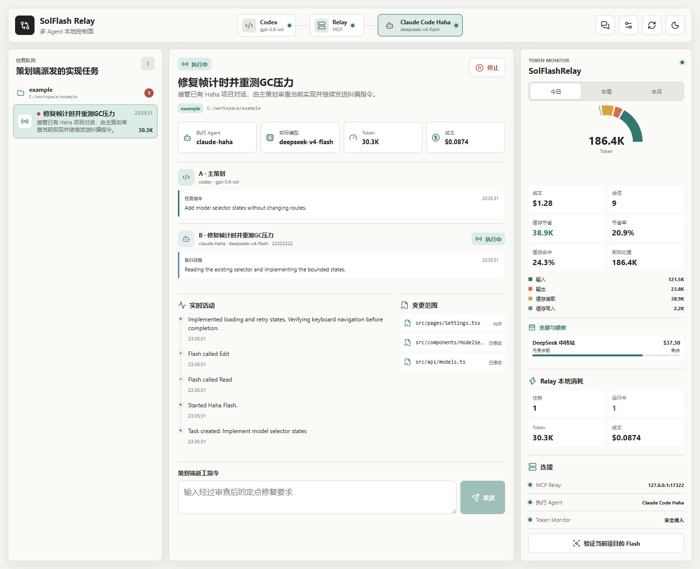
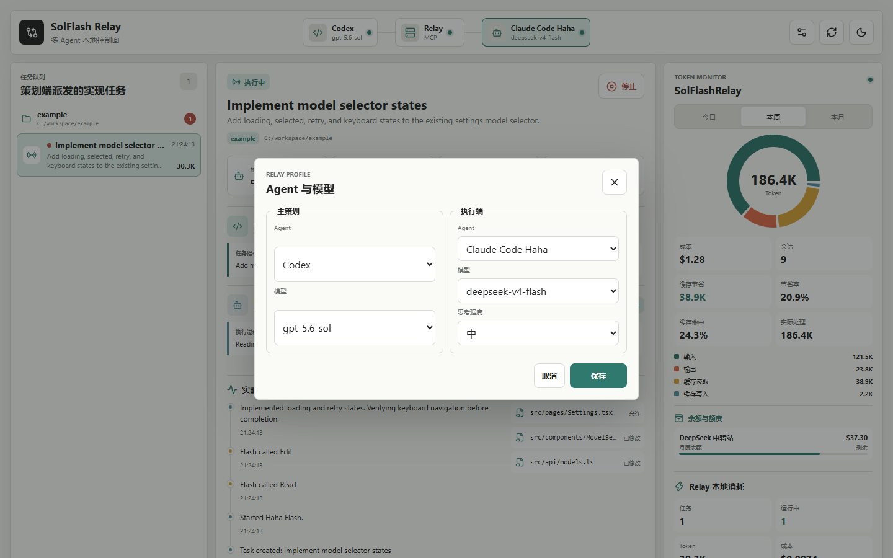
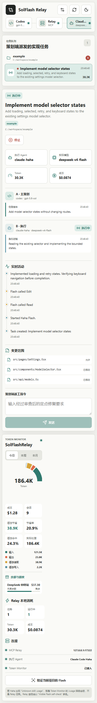
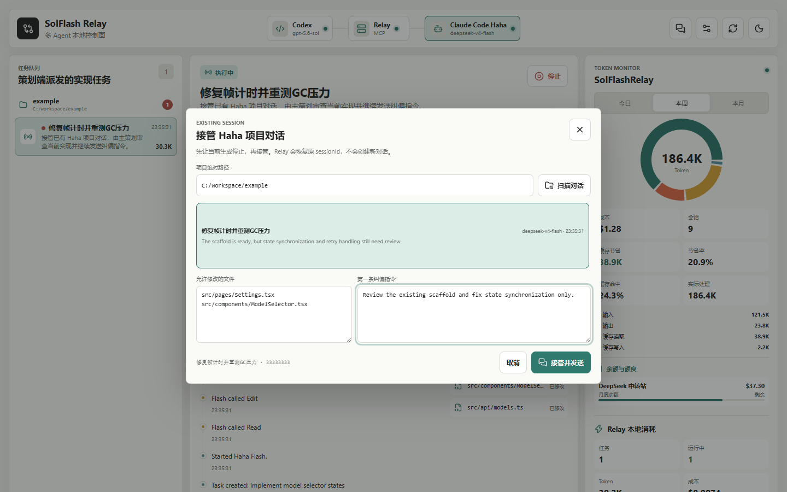
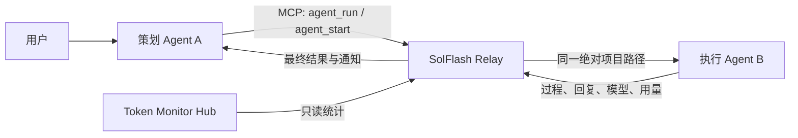
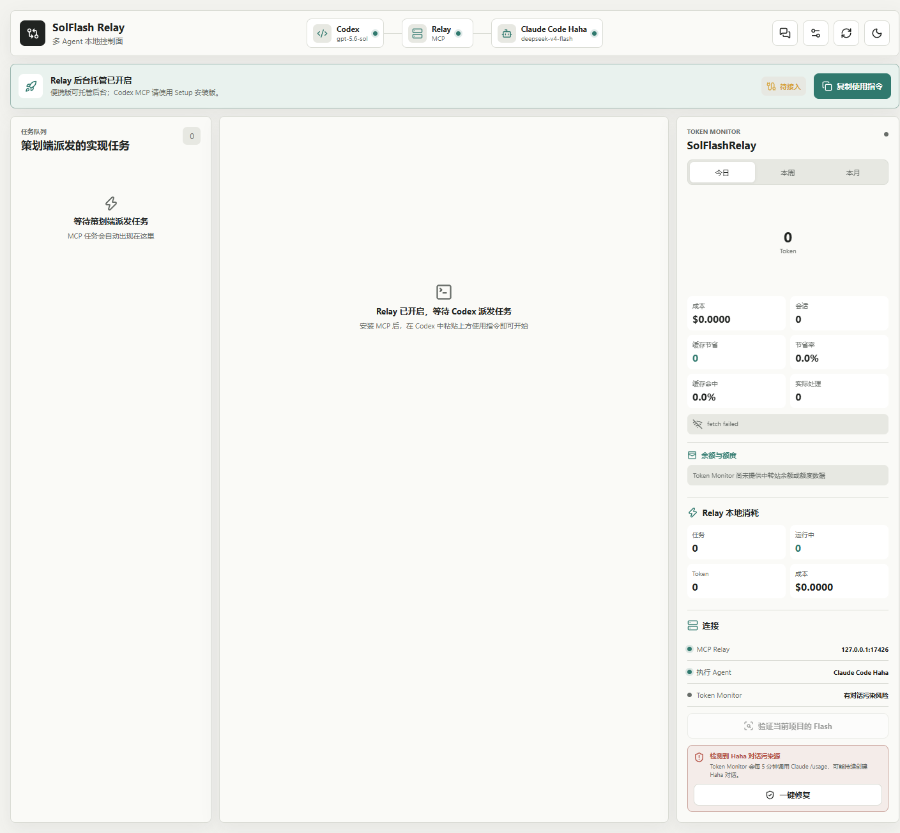

# SolFlash Relay

**中文** | [English](#english)

当前版本 / Current version: `0.6.1`<br>
Windows 10/11 · MIT License · Local-first · MCP

SolFlash Relay 是一个本地多 Agent 编程控制面：让 Codex / Sol 负责规划、架构、UI 与最终审查，再把边界明确的代码实现交给 Claude Code Haha / DeepSeek Flash 或其他执行 Agent。

它不接管 API Key，不转发模型 API，也不把第三个模型塞进链路。每个 Agent 继续使用自己的登录、Provider、模型配置和原生对话记录；Relay 只负责结构化派发、同项目路径绑定、进度监控、结果回传与用量审计。

[下载 Windows EXE / Download](https://github.com/OPFIMISS/SolFlash-Relay/releases/latest) · [问题反馈 / Issues](https://github.com/OPFIMISS/SolFlash-Relay/issues)



## 为什么需要它

- **Sol 做上级，Flash 做执行**：策划 Agent 决定架构与验收范围，执行 Agent 只完成明确的机械实现。
- **保留原生 Agent 体验**：Haha 任务使用与 Codex 相同的绝对项目路径，并保留在 Haha 的可见项目会话中。
- **A 自动收到 B 的结果**：`agent_run` 会等待执行 Agent 的最终回复并直接返回给策划 Agent；异步任务仍可使用 `agent_start`、`flash_wait` 和 `flash_send`。
- **一个任务，两段对话**：工作台按项目路径聚合任务，上方显示 A 的初始指令与返工，下方显示 B 的过程和最终回复。
- **后台托管与通知**：关闭窗口后继续在托盘运行；任务完成或失败时发送 Windows 通知，并显示任务栏未读 `1` 角标。
- **模型可核验**：同时记录请求模型、Haha CLI 实际接收的模型别名和 Provider 回报的有效模型；空回复不再被误判为完成。
- **费用与 Token**：显示输入、输出、缓存读取、缓存写入、成本、缓存节省率、命中率，以及 Token Monitor 提供的余额或额度。
- **自由切换 Agent**：内置 Codex、Claude Code Haha、Claude Code CLI、OpenCode、Reasonix 适配器，并支持无凭据的自定义 CLI 描述。
- **中途接管已有 Haha 对话**：按项目绝对路径扫描原生 Haha 会话，复用原 `sessionId` 发送 Sol 的纠偏指令，不创建新对话。
- **阻止 `/usage` 对话污染**：检测 Token Monitor 的 Claude 额度轮询，备份配置后可一键关闭，同时保留其他 Provider 和历史数据。

## 0.6.1 重点更新

- 修复大型 Haha 会话只扫描到部分对话的问题：以原始 `session-meta.workDir` 判断项目归属，不会因为会话后期进入子目录而漏掉。
- 接管列表、任务标题和 B 对话栏使用 Haha 的真实 `ai-title`；无 AI 标题时使用第一条真实用户提示，并过滤内部 `<task-notification>`。
- B 对话栏同时显示原会话短 `sessionId`，同项目内多个对话可以准确区分。
- 自动排除 Token Monitor 产生的 `Unknown skill: usage` 探测会话，不让它们出现在可接管列表中。
- 新增 Token Monitor 兼容性检测与一键修复：仅从 `limitProviders` 移除 `claude`，修改前自动备份配置。
- 保留同步 `agent_run`、可见 Flash 自检、Windows 通知、任务栏未读角标和 A/B 双对话工作台。

## 界面

| Agent 与模型设置 | 移动端布局 |
| --- | --- |
|  |  |

设置页可以切换主策划 Agent / 模型、执行 Agent / 模型、思考强度，也可以填写中转站提供的任意模型 ID，例如 `sol`、`luna` 或其他自定义名称。Relay 不保存或管理这些 Agent 的 API Key。

### 接管已有 Haha 对话



右上角的对话按钮可以接管一个已经由 Flash 搭好架子的 Haha 会话。Relay 会按绝对项目路径读取原生会话记录，显示实际模型、更新时间和上次回复，并继续使用原 `sessionId`。

## 工作方式



1. Sol 检查代码库并决定架构、UI、文件范围和验收命令。
2. Sol 调用 `agent_run`，传入当前项目的绝对路径、`allowedFiles`、约束和指定执行模型。
3. Relay 在同一路径创建 Haha 或其他执行 Agent 会话；也可以接管该路径下已有的 Haha 会话。
4. B 完成后，Relay 通知用户并把最终回复直接交还 A。
5. Sol 审查真实 Git diff 并运行测试；需要修正时，用 `flash_send` 恢复同一执行会话。

## Windows 安装

推荐从 [Releases](https://github.com/OPFIMISS/SolFlash-Relay/releases) 下载：

- `SolFlash-Relay-0.6.1-x64-setup.exe`：推荐版本，支持后台托管和一键安装 Codex MCP。
- `SolFlash-Relay-0.6.1-x64-portable.exe`：便携控制台与后台宿主；由于便携外壳不能稳定转发 MCP stdio，不提供一键 MCP 安装。

安装版使用步骤：

1. 启动 SolFlash Relay。
2. 打开右上角“Agent 与模型”，确认执行端为 `Claude Code Haha` 和 `deepseek-v4-flash`。
3. 点击“安装 Codex MCP”，然后重启 Codex。
4. 点击“复制使用指令”，在需要作为策划端的 Codex 项目中粘贴并描述任务。
5. 首次使用可在已有项目任务上点击“验证当前项目的 Flash”，它会产生一次很小的真实模型调用。

关闭窗口只会隐藏到托盘。要彻底停止 Relay，请使用托盘菜单“退出”或设置页电源按钮。

## 五分钟使用教程

### 0. 使用前准备

开始前确认以下三点：

1. 已安装 Claude Code Haha，并在 Haha 内配置好 Provider / API。
2. 在 Haha 中手动新建一次普通会话，确认目标模型可以正常回复。
3. 下载的是 `SolFlash-Relay-0.6.1-x64-setup.exe`，不是 Portable 便携版。

> **Codex MCP 安装仅支持 Setup 版本。** Portable 只提供面板与后台托管；切换到 Setup 前，请先从托盘退出 Portable。

### 1. 安装并启动 Setup 版本

从 [GitHub Releases](https://github.com/OPFIMISS/SolFlash-Relay/releases/latest) 下载 `SolFlash-Relay-0.6.1-x64-setup.exe`，完成安装后启动 SolFlash Relay。

看到顶部“Relay 后台托管已开启”说明本地服务已经运行。关闭窗口后它仍会留在 Windows 托盘中。

### 2. 选择上级和下级 Agent

点击右上角设置按钮，第一次使用建议这样配置：

| 设置 | 推荐值 |
| --- | --- |
| 主策划 Agent | `Codex` |
| 主策划模型 | `gpt-5.6-sol` |
| 执行 Agent | `Claude Code Haha` |
| 执行模型 | `deepseek-v4-flash` |
| 思考强度 | `中` |


“最大”思考强度不是开启 Relay 的必要条件。小任务先使用“中”更省 Token，复杂任务再提高。保存后，顶部链路应显示 `Codex → Relay → Claude Code Haha`。

### 3. 安装 Codex MCP

1. 在设置窗口点击“安装 Codex MCP”。
2. 等待出现安装成功提示。
3. **彻底退出并重新启动 Codex**，只关闭当前项目页面可能不会重新加载 MCP。
4. 保持 SolFlash Relay 在运行或托盘后台状态。

安装只需要做一次。以后启动 Codex 时，MCP 会连接现有 Relay；Relay 未运行时，安装版也可以自动拉起后台宿主。

### 4. 在 Codex 项目中派发第一个任务

在 Codex 中打开你真正要修改的项目。Relay 会把这个项目的**绝对路径**交给 Haha，因此不要先在无关目录中创建任务。

点击 Relay 顶部的“复制使用指令”，粘贴到 Codex，然后在后面写具体需求。也可以直接使用下面的示例：

```text
使用 SolFlash Relay 完成这个任务。

你负责分析现有代码、决定架构和最终审查。请先明确允许修改的文件、约束和验收命令，
然后优先调用 agent_run，把机械代码实现交给 Claude Code Haha 的 deepseek-v4-flash。
必须使用当前 Codex 项目的绝对路径。Flash 完成后检查真实 Git diff 并运行测试。

任务：给设置页面的保存按钮增加加载状态，避免连续重复提交。
```

正常情况下，Codex 会自动调用 Relay 的 `agent_run`。你不需要手动复制提示词到 Haha，也不需要在 Relay 面板中创建任务。

### 5. 查看执行过程和结果

任务开始后可以同时在两个地方观察：

- **SolFlash Relay**：左侧按项目路径显示任务；中间上方是 A（Codex）的指令，下方是 B（Haha）的回复；右侧显示 Token、费用、缓存和余额。
- **Claude Code Haha**：同一个项目路径下会出现 Relay 创建的可见会话，可以直接查看 Flash 的原生执行记录。

任务完成或失败后，Windows 会发送系统通知，并在任务栏显示未读 `1`。点击通知会打开对应任务，聚焦 Relay 后清除未读。

Relay 会分别显示：

- 请求模型：例如 `deepseek-v4-flash`
- 执行 CLI 接收的别名：例如 `haiku`
- Provider 最终回报的有效模型：应为 `deepseek-v4-flash`

只有收到非空最终回复时任务才会显示“已完成”。

### 6. 审查和返工

Flash 完成后，Sol 仍然负责最终质量。让 Codex 检查真实 diff、越界文件和测试结果。如果只需局部修正，可以在 Codex 中继续要求它调用 `flash_send`，或在 Relay 任务底部输入“策划端返工指令”。Relay 会恢复同一个 Haha 会话。

### 7. 中途接管已有 Haha 对话

适合这种情况：先在 Haha 中让 Flash 搭了一个架子，发现方向不够准确，希望让 Sol 接手审查并继续指导同一个对话。

1. 先停止或等待 Haha 当前这轮生成结束，不要让两个进程同时写入同一会话。
2. 在 Relay 右上角点击“接管已有 Haha 对话”。
3. 填写或确认项目绝对路径，点击“扫描对话”。
4. 按与 Haha 侧栏一致的真实标题选择会话。Relay 还会显示短 `sessionId`、模型、更新时间和上次回复，并自动填入当前 Git 改动文件。
5. 检查“允许修改的文件”，填写第一条纠偏指令，然后点击“接管并发送”。
6. Relay 使用原 `sessionId` 恢复对话；后续可以继续使用任务底部的返工输入框或 `flash_send`。

接管不会复制整个对话到一个新会话，也不会迁移 API 配置。Relay 只读取必要的会话摘要并通过 Haha 自己的 `--resume` 能力续聊。

也可以直接在 Codex 中要求 Sol 执行：先调用 `haha_sessions` 并传入当前项目绝对路径，选择正确的 `sessionId` 后调用 `haha_adopt`，同时给出 `allowedFiles`、纠偏指令和等待时间。`haha_adopt` 会等待 Flash 的最终回复并直接返回给 Sol。

### 第一次连接失败怎么办

| 现象 | 处理方法 |
| --- | --- |
| 点击“安装 Codex MCP”提示便携版不支持 | 退出 Portable，安装并运行 Setup EXE |
| Codex 中没有 Relay 工具或任务不出现 | 重新点击安装 MCP，然后彻底退出并重启 Codex |
| Relay 显示旧设置或旧任务 | 从托盘退出所有旧版 Relay，只保留最新安装版 |
| Haha 显示 Pro | 检查 Relay 任务里的“请求模型/实际模型”，不要只看当前选中的 Haha 会话 |
| Haha 出现 `Unknown skill: usage` | 在 Relay 的“连接”区域点击“一键修复”，然后退出并重启 Token Monitor |
| Token Monitor 显示 `fetch failed` | 不影响任务执行；Token Monitor 是可选的只读统计组件 |
| 想确认 Flash 链路 | 先完成一个任务，再点击“验证当前项目的 Flash”；该按钮会产生一次很小的真实调用 |

## 关于 Pro、Flash 与 `Unknown skill: usage`

Haha 输入框底部显示的是**当前所选 Haha 会话**的模型。Relay 发起的任务会显式传递请求模型，并在任务详情中显示最终有效模型。

如果 Haha 中出现大量名为 `Unknown skill: usage` 的会话，它们不是 Relay 创建的任务。Token Monitor `0.42.1` 在 Windows 上可能每 5 分钟执行一次 `claude /usage`；Haha 不认识该命令时会把探测保存为新对话，并继承全局默认模型，因此可能显示 Pro 且没有模型回复。

Relay `0.6.1` 会检查 `%APPDATA%\Token Monitor\settings.json`。检测到风险时，“连接”区域会显示红色警告和“一键修复”：修复前自动创建 `.solflash-backup-*` 备份，只从 `limitProviders` 移除 `claude`，不会修改其他 Provider、凭据、用量历史或已有 Haha 对话。修复后退出并重启 Token Monitor 使正在运行的实例立即应用。



## Token Monitor 接入

Relay 默认只读接入 [Javis603/token-monitor](https://github.com/Javis603/token-monitor) Hub API，不捆绑 Token Monitor。只有用户主动点击兼容性“一键修复”时，Relay 才会备份并修改 Token Monitor 的本地 Provider 选择，以关闭有副作用的 Claude `/usage` 轮询。

```dotenv
TOKEN_MONITOR_URL=http://127.0.0.1:17321
TOKEN_MONITOR_SECRET=
TOKEN_MONITOR_PROJECT_LABEL=SolFlashRelay
```

Token Monitor 不可用时，Relay 仍可显示执行 Agent 直接回报的 Token 与成本；Provider 余额或额度只在 Hub API 实际提供对应字段时显示。

## 源码开发

```powershell
npm install
npm run build
npm run typecheck
npm run test:server
npm run test:agents
npm run test:token-monitor
npm run test:token-monitor-compat
npm run test:haha-sessions
npm run test:mcp
npm run test:codex-config
npm run test:ui
npm run test:desktop
```

真实 Haha 测试会产生模型费用：

```powershell
$env:ALLOW_PAID_VISIBLE_E2E="1"
npm run test:e2e:visible
```

## 安全边界

- 默认只监听 `127.0.0.1`。
- Provider 凭据由各 Agent 自己管理，Relay 不通过 MCP 或 UI 返回凭据。
- `allowedFiles` 在派发前校验，并在执行后用 Git 状态与内容哈希审计越界修改。
- Relay 不自动 commit、reset、restore、checkout 或接受 diff。
- 接管已有会话时只读取必要摘要；必须等待当前 Haha 生成结束后再恢复同一 `sessionId`。
- 开启 `HAHA_ALLOW_SHELL=true` 会允许执行 Agent 在指定项目运行命令；最终审查仍由策划 Agent 负责。

---

<a id="english"></a>

## English

SolFlash Relay is a local multi-Agent coding control plane. Codex / Sol owns planning, architecture, UI decisions, and final review; Claude Code Haha / DeepSeek Flash, or another configured execution Agent, handles tightly bounded implementation work.

Relay does not proxy model APIs or own provider credentials. Every Agent keeps its native login, provider settings, model selection, and conversation storage. Relay transports structured tasks, binds execution to the planner's exact project path, monitors progress, returns results, and audits usage.

### Highlights

- `agent_run` starts an execution task and waits for the final reply in one MCP call.
- `agent_start`, `flash_wait`, and `flash_send` remain available for asynchronous work and targeted same-session repairs.
- Tasks are grouped by absolute project path, with planner conversation A above executor conversation B.
- Haha sessions remain visible in the native Haha desktop project and use the same working directory as Codex.
- Windows notifications and a taskbar unread `1` badge report completion or failure while Relay is hosted in the tray.
- Requested model, Haha CLI alias, and provider-reported effective model are recorded separately. Missing or empty replies fail explicitly.
- Built-in profiles cover Codex, Claude Code Haha, Claude Code CLI, OpenCode, and Reasonix, plus credential-free custom CLI adapters.
- Existing Haha conversations can be adopted by exact project path and resumed with the original `sessionId` for Sol-directed corrections.
- Version `0.6.1` reads the canonical project path from Haha session metadata, so sessions are not lost when later messages run in a project subdirectory.
- Adopted task and executor conversation titles match Haha's native AI title, with a short `sessionId` shown for unambiguous identification; internal task notifications are excluded.
- Token Monitor integration adds cache savings, hit rate, cost, and provider balance/quota, while detecting the incompatible Claude `/usage` polling behavior.

### Install

Download the recommended Setup build from [GitHub Releases](https://github.com/OPFIMISS/SolFlash-Relay/releases):

- `SolFlash-Relay-0.6.1-x64-setup.exe`: desktop host, tray mode, and one-click Codex MCP installation.
- `SolFlash-Relay-0.6.1-x64-portable.exe`: portable dashboard and background host; MCP stdio installation requires the Setup build.

Open Agent settings, select the planner/executor profiles and models, install Codex MCP, restart Codex, then paste the copied Relay instruction into the Codex project that should act as planner.

### Five-minute quick start

1. Configure Haha's provider/API first and verify that Haha can answer a normal message.
2. Install `SolFlash-Relay-0.6.1-x64-setup.exe`. The Portable build cannot install Codex MCP; exit it from the tray before using Setup.
3. In Relay settings, choose `Codex / gpt-5.6-sol` as planner and `Claude Code Haha / deepseek-v4-flash` as executor. Start with medium effort to reduce cost.
4. Click **Install Codex MCP**, then fully quit and restart Codex.
5. Open the real target project in Codex, click **Copy usage instruction** in Relay, and paste it before your implementation request.
6. Codex should call `agent_run` automatically. Relay creates a visible Haha conversation under the same absolute project path and returns the final reply to Codex.
7. Review the real Git diff and tests in Codex. Use `flash_send` or the Relay follow-up box only for a targeted correction in the same Haha session.

### Adopt an existing Haha conversation

Use this when Flash already created a scaffold in Haha and Sol should step in without losing the original conversation:

1. Wait for the current Haha response to finish or stop it. Do not let two processes write to the same session concurrently.
2. Click **Adopt existing Haha conversation** in the Relay toolbar.
3. Enter the exact project path and scan its native Haha sessions.
4. Select a session by the same title shown in Haha. Relay also shows its short `sessionId`, detected model, latest response, and suggested Git-changed files.
5. Confirm the allowed file list, enter Sol's first correction, and click **Adopt and send**.

Relay filters out `Unknown skill: usage` probes, imports the selected conversation as an adopted task, and resumes the original `sessionId`; it does not copy the conversation into a new Haha session or migrate provider credentials.

From Codex, Sol can call `haha_sessions` with the current absolute project path, select the intended `sessionId`, then call `haha_adopt` with the allowed files, correction, and timeout. `haha_adopt` waits for the final Flash reply and returns it directly to Sol.

Example Codex request:

```text
Use SolFlash Relay for this task. Inspect the repository and decide the architecture first.
Define narrow allowed files, constraints, and acceptance commands, then call agent_run
with this Codex project's absolute path and delegate the mechanical implementation to
Claude Code Haha deepseek-v4-flash. Review the real Git diff and tests after it returns.

Task: add a loading state to the settings save button to prevent duplicate submissions.
```

If Codex does not expose the Relay tools after installation, reinstall MCP and fully restart Codex. If Relay appears to show old settings, exit every older Relay instance from the Windows tray and keep only the latest Setup build running.

### Flash verification

The **Verify Flash for current project** action makes a small real provider call. It creates a visible Haha session named `Visible Flash self-check`, requires `deepseek-v4-flash`, checks the provider-reported effective model, requires a non-empty final reply, and writes an ignored proof file.

If Haha contains many `Unknown skill: usage` sessions, those are created by Token Monitor `0.42.1` `/usage` probes rather than Relay. On Windows the probe may run every five minutes, inherit Haha's global default model, and create a Pro-labelled session without a model reply.

Relay `0.6.1` detects this configuration and displays a repair action. The repair creates a `.solflash-backup-*` copy and removes only `claude` from Token Monitor's `limitProviders`; it preserves every other provider, credentials, usage history, and existing Haha conversation. Restart Token Monitor after repair so the running instance applies the change.

### Development and security

The packaged Windows application includes its runtime. Node.js 20+ is required only for source development. Relay binds to localhost by default, does not expose provider secrets, validates `allowedFiles`, audits changed files after execution, and leaves all final code review to the planning Agent.

License: [MIT](LICENSE)
