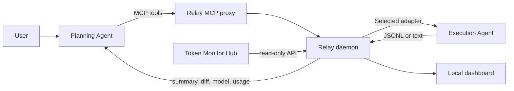

# SolFlash Relay

Current version: `0.3.0`.

SolFlash Relay is a local, model-free control plane for delegating bounded implementation work between configurable planning and execution Agents.

It does not proxy model APIs, synchronize full conversations, or add a third planning model. Each Agent keeps its own login, provider configuration, and native conversation storage. Relay transports structured tasks, binds the executor to the planner's project path, streams activity, records usage, and returns compact results to the planner.

## Architecture



## Current capabilities

- Generic `agent_start`, profile selection, adapter registration, and backward-compatible `flash_*` MCP tools.
- Switchable planning Agent/model and execution Agent/model defaults from the dashboard or MCP.
- Built-in adapters for Claude Code Haha, Claude Code CLI, OpenCode, and Reasonix, plus credential-free custom CLI manifests.
- Persistent executor session IDs with same-session follow-up when the selected Agent supports resume.
- The executor always receives the exact absolute project path supplied by the planner. Haha desktop sessions are grouped under that same project.
- Existing provider credentials remain managed by their owning Agent. Relay never returns them through MCP or the dashboard.
- Haha model IDs are resolved through its active provider slots and checked against the effective model returned by the run.
- Live task events, tool calls, summaries, model usage, token counts, and cost.
- Before/after Git status and content hashes with warnings for files outside `allowedFiles`.
- Local rounded dashboard with light/dark themes, task queue, event timeline, scope view, cancellation, and same-session follow-up.
- Read-only integration with [Javis603/token-monitor](https://github.com/Javis603/token-monitor) Hub API.

## Requirements

- Windows 10/11.
- Claude Code Haha installed and already able to use the desired provider.
- Codex desktop/CLI with local MCP support.
- Optional: Token Monitor Hub listening on port `17321`.

The packaged Windows application includes its own runtime. Node.js 20 or newer is only required for source development.

## Windows application

Release artifacts are written to `release`:

- `SolFlash-Relay-0.3.0-x64-setup.exe`: recommended. Installs the desktop application and supports one-click Codex MCP configuration.
- `SolFlash-Relay-0.3.0-x64-portable.exe`: portable dashboard and background host. The NSIS portable shell cannot reliably forward MCP stdio, so it intentionally refuses to install itself as a Codex MCP server.

Closing the window hides Relay to the notification area and keeps active Agent tasks hosted. Click the tray icon or start the application again to restore the same instance. Use the tray menu or the power button in settings to terminate Relay and its Agent child processes completely.

From the installed application, open Agent and model settings and click `安装 Codex MCP`. The generated Codex entry uses the installed EXE's bundled Node mode for MCP stdio and starts the same EXE with `--background` whenever the Relay host is not already running. Restart Codex after installation.

Desktop state and task data are stored under `%APPDATA%\SolFlash Relay\relay-data`.

## Source install

```powershell
npm install
npm run build
& .\scripts\install-codex-mcp.ps1
```

Restart Codex after installing the MCP entry. The MCP proxy checks the daemon and starts it automatically when needed.

Open the dashboard manually:

```powershell
& .\scripts\start-relay.ps1
```

Dashboard: `http://127.0.0.1:17322`

## Codex workflow

Ask the planning Agent to keep architecture and review responsibility:

```text
Use SolFlash Relay. Decide the architecture and UI first, then call agent_start
with the absolute path of this current project and narrow allowedFiles. Wait for
the executor, review the actual diff and tests, and use flash_send only for a
targeted follow-up in the same session.
```

The intended sequence is:

1. The planner inspects the current repository and makes design decisions.
2. It calls `agent_start` with the current project's absolute path, a bounded objective, file allowlist, constraints, and acceptance commands.
3. Relay launches the selected executor in that exact directory and streams activity to the dashboard.
4. The planner waits for completion, reviews the real Git diff, and runs verification.
5. It sends at most two targeted repair attempts. The same executor session is resumed when supported.

## Agent Adapter Skill

The bundled `.agents/skills/agent-adapter` skill guides an AI through integrating another local Agent without moving credentials. Install it into another project with:

```powershell
& .\scripts\install-agent-skill.ps1 -TargetProject "D:\path\to\project"
```

## Token Monitor integration

Token Monitor is not modified or bundled. Relay reads its documented Hub API.

```dotenv
TOKEN_MONITOR_URL=http://127.0.0.1:17321
TOKEN_MONITOR_SECRET=
TOKEN_MONITOR_PROJECT_LABEL=SolFlashRelay
```

When the Hub is unavailable, the dashboard remains functional and shows Relay's directly captured Haha usage. Once Token Monitor is running, the panel adds project-level Codex/Claude client and model totals.

## Configuration

Copy `.env.example` to `.env` when defaults do not match the machine.

| Variable | Default | Purpose |
| --- | --- | --- |
| `RELAY_PORT` | `17322` | Dashboard and daemon API port |
| `RELAY_DATA_DIR` | `.relay-data` | Task and event state |
| `HAHA_ROOT` | `D:\Claude Code Haha` | Haha installation directory |
| `HAHA_GLOBAL_CONFIG_DIR` | `%USERPROFILE%\.claude` | Existing Haha-owned configuration |
| `HAHA_STATE_DIR` | `.relay-data/haha-state` | Relay-owned session persistence |
| `HAHA_MODEL` | `deepseek-v4-flash` | Default worker model ID |
| `HAHA_EFFORT` | `medium` | Default worker effort |
| `HAHA_ALLOW_SHELL` | `true` | Allow Bash for builds and tests |
| `HAHA_SHARE_DESKTOP_STATE` | `true` | Show production Relay sessions in Haha desktop under the task workdir |

## Security model

- The server binds to `127.0.0.1` by default.
- Provider secrets are not returned by the API or dashboard.
- `allowedFiles` is validated before dispatch and audited after execution.
- Relay never commits, resets, restores, or applies a diff automatically.
- `HAHA_ALLOW_SHELL=true` gives Flash unattended shell access in the selected workdir. Disable it when file editing alone is sufficient.
- The planning Agent remains responsible for reviewing all changed files and running final verification.

## Development

```powershell
npm run dev
npm run typecheck
npm run test:server
npm run test:agents
npm run test:mcp
npm run test:mcp:packaged
npm run test:token-monitor
npm run test:ui
npm run test:desktop
npm run test:desktop:packaged
npm run test:e2e
npm run build
```

`test:e2e` makes real Haha provider calls and therefore incurs model cost.

## Status

Current deliberate limitations:

- Planner model selection records Relay defaults; the active host application still owns the actual planner model switch.
- Claude Code Haha production sessions are visible through its normal session index, while E2E tests use an isolated state directory.
- Worktree isolation is not implemented yet; Sol must not edit the same files while Flash is running.
- Token Monitor integration requires its Hub API. Local widget-only mode is not scraped.
- The portable EXE supports the dashboard and background hosting, but Codex MCP requires the Setup installation because the portable launcher does not preserve stdio pipes.
