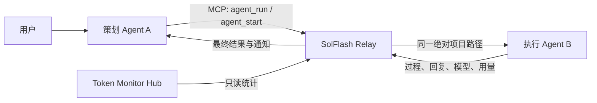

# SolFlash Relay

**中文** | [English](#english)

当前版本 / Current version: `0.5.0`<br>
Windows 10/11 · MIT License · Local-first · MCP

SolFlash Relay 是一个本地多 Agent 编程控制面：让 Codex / Sol 负责规划、架构、UI 与最终审查，再把边界明确的代码实现交给 Claude Code Haha / DeepSeek Flash 或其他执行 Agent。

它不接管 API Key，不转发模型 API，也不把第三个模型塞进链路。每个 Agent 继续使用自己的登录、Provider、模型配置和原生对话记录；Relay 只负责结构化派发、同项目路径绑定、进度监控、结果回传与用量审计。

[下载 Windows EXE / Download](https://github.com/OPFIMISS/SolFlash-Relay-/releases/latest) · [问题反馈 / Issues](https://github.com/OPFIMISS/SolFlash-Relay-/issues)


## 为什么需要它

- **Sol 做上级，Flash 做执行**：策划 Agent 决定架构与验收范围，执行 Agent 只完成明确的机械实现。
- **保留原生 Agent 体验**：Haha 任务使用与 Codex 相同的绝对项目路径，并保留在 Haha 的可见项目会话中。
- **A 自动收到 B 的结果**：`agent_run` 会等待执行 Agent 的最终回复并直接返回给策划 Agent；异步任务仍可使用 `agent_start`、`flash_wait` 和 `flash_send`。
- **一个任务，两段对话**：工作台按项目路径聚合任务，上方显示 A 的初始指令与返工，下方显示 B 的过程和最终回复。
- **后台托管与通知**：关闭窗口后继续在托盘运行；任务完成或失败时发送 Windows 通知，并显示任务栏未读 `1` 角标。
- **模型可核验**：同时记录请求模型、Haha CLI 实际接收的模型别名和 Provider 回报的有效模型；空回复不再被误判为完成。
- **费用与 Token**：显示输入、输出、缓存读取、缓存写入、成本、缓存节省率、命中率，以及 Token Monitor 提供的余额或额度。
- **自由切换 Agent**：内置 Codex、Claude Code Haha、Claude Code CLI、OpenCode、Reasonix 适配器，并支持无凭据的自定义 CLI 描述。

## 0.5.0 重点更新

- 新增同步 `agent_run` MCP 工具，让 Sol 在一次工具调用中等待执行结果。
- 新增可见 Flash 自检，明确强制 `deepseek-v4-flash`，并校验真实回复、有效模型和证明文件。
- 新增 Windows 系统通知、任务栏未读角标、点击通知打开对应任务、聚焦后清除未读。
- 新增按绝对路径分组的项目工作台，以及 A / B 上下双 Agent 对话。
- 检测旧 Relay 占用端口，避免新版 UI 意外连接旧版 daemon。
- 修复 Windows 状态文件替换偶发 `EPERM` 导致任务已执行但结果无法持久化的问题。

## 界面

| Agent 与模型设置 | 移动端布局 |
| --- | --- |
|  |  |

设置页可以切换主策划 Agent / 模型、执行 Agent / 模型、思考强度，也可以填写中转站提供的任意模型 ID，例如 `sol`、`luna` 或其他自定义名称。Relay 不保存或管理这些 Agent 的 API Key。

## 工作方式



1. Sol 检查代码库并决定架构、UI、文件范围和验收命令。
2. Sol 调用 `agent_run`，传入当前项目的绝对路径、`allowedFiles`、约束和指定执行模型。
3. Relay 在同一路径创建 Haha 或其他执行 Agent 会话，并持续记录工具调用和输出。
4. B 完成后，Relay 通知用户并把最终回复直接交还 A。
5. Sol 审查真实 Git diff 并运行测试；需要修正时，用 `flash_send` 恢复同一执行会话。

## Windows 安装

推荐从 [Releases](https://github.com/OPFIMISS/SolFlash-Relay-/releases) 下载：

- `SolFlash-Relay-0.5.0-x64-setup.exe`：推荐版本，支持后台托管和一键安装 Codex MCP。
- `SolFlash-Relay-0.5.0-x64-portable.exe`：便携控制台与后台宿主；由于便携外壳不能稳定转发 MCP stdio，不提供一键 MCP 安装。

安装版使用步骤：

1. 启动 SolFlash Relay。
2. 打开右上角“Agent 与模型”，确认执行端为 `Claude Code Haha` 和 `deepseek-v4-flash`。
3. 点击“安装 Codex MCP”，然后重启 Codex。
4. 点击“复制使用指令”，在需要作为策划端的 Codex 项目中粘贴并描述任务。
5. 首次使用可在已有项目任务上点击“验证当前项目的 Flash”，它会产生一次很小的真实模型调用。

关闭窗口只会隐藏到托盘。要彻底停止 Relay，请使用托盘菜单“退出”或设置页电源按钮。

## 关于 Pro、Flash 与 `Unknown skill: usage`

Haha 输入框底部显示的是**当前所选 Haha 会话**的模型。Relay 发起的任务会显式传递请求模型，并在任务详情中显示最终有效模型。

如果 Haha 中出现大量名为 `Unknown skill: usage` 的会话，它们不是 Relay 创建的任务。Token Monitor `0.42.1` 会定期向 Haha 发送 `/usage` 探测，该探测继承 Haha 的全局默认模型，因此可能显示 Pro 且没有模型回复。Relay 的自检会以 `Visible Flash self-check` 命名，便于区分。

## Token Monitor 接入

Relay 只读接入 [Javis603/token-monitor](https://github.com/Javis603/token-monitor) Hub API，不修改也不捆绑 Token Monitor。

```dotenv
TOKEN_MONITOR_URL=http://127.0.0.1:17321
TOKEN_MONITOR_SECRET=
TOKEN_MONITOR_PROJECT_LABEL=SolFlashRelay
```

Token Monitor 不可用时，Relay 仍可显示执行 Agent 直接回报的 Token 与成本；Provider 余额或额度只在 Hub API 实际提供对应字段时显示。

## 源码开发

```powershell
npm install
npm run build
npm run typecheck
npm run test:server
npm run test:agents
npm run test:token-monitor
npm run test:mcp
npm run test:codex-config
npm run test:ui
npm run test:desktop
```

真实 Haha 测试会产生模型费用：

```powershell
$env:ALLOW_PAID_VISIBLE_E2E="1"
npm run test:e2e:visible
```

## 安全边界

- 默认只监听 `127.0.0.1`。
- Provider 凭据由各 Agent 自己管理，Relay 不通过 MCP 或 UI 返回凭据。
- `allowedFiles` 在派发前校验，并在执行后用 Git 状态与内容哈希审计越界修改。
- Relay 不自动 commit、reset、restore、checkout 或接受 diff。
- 开启 `HAHA_ALLOW_SHELL=true` 会允许执行 Agent 在指定项目运行命令；最终审查仍由策划 Agent 负责。

---

<a id="english"></a>

## English

SolFlash Relay is a local multi-Agent coding control plane. Codex / Sol owns planning, architecture, UI decisions, and final review; Claude Code Haha / DeepSeek Flash, or another configured execution Agent, handles tightly bounded implementation work.

Relay does not proxy model APIs or own provider credentials. Every Agent keeps its native login, provider settings, model selection, and conversation storage. Relay transports structured tasks, binds execution to the planner's exact project path, monitors progress, returns results, and audits usage.

### Highlights

- `agent_run` starts an execution task and waits for the final reply in one MCP call.
- `agent_start`, `flash_wait`, and `flash_send` remain available for asynchronous work and targeted same-session repairs.
- Tasks are grouped by absolute project path, with planner conversation A above executor conversation B.
- Haha sessions remain visible in the native Haha desktop project and use the same working directory as Codex.
- Windows notifications and a taskbar unread `1` badge report completion or failure while Relay is hosted in the tray.
- Requested model, Haha CLI alias, and provider-reported effective model are recorded separately. Missing or empty replies fail explicitly.
- Built-in profiles cover Codex, Claude Code Haha, Claude Code CLI, OpenCode, and Reasonix, plus credential-free custom CLI adapters.
- Read-only Token Monitor integration adds cache savings, hit rate, cost, and provider balance/quota when available.

### Install

Download the recommended Setup build from [GitHub Releases](https://github.com/OPFIMISS/SolFlash-Relay-/releases):

- `SolFlash-Relay-0.5.0-x64-setup.exe`: desktop host, tray mode, and one-click Codex MCP installation.
- `SolFlash-Relay-0.5.0-x64-portable.exe`: portable dashboard and background host; MCP stdio installation requires the Setup build.

Open Agent settings, select the planner/executor profiles and models, install Codex MCP, restart Codex, then paste the copied Relay instruction into the Codex project that should act as planner.

### Flash verification

The **Verify Flash for current project** action makes a small real provider call. It creates a visible Haha session named `Visible Flash self-check`, requires `deepseek-v4-flash`, checks the provider-reported effective model, requires a non-empty final reply, and writes an ignored proof file.

If Haha contains many `Unknown skill: usage` sessions, those are created by Token Monitor `0.42.1` `/usage` probes rather than Relay. They inherit Haha's global default model and may therefore display Pro without a model response.

### Development and security

The packaged Windows application includes its runtime. Node.js 20+ is required only for source development. Relay binds to localhost by default, does not expose provider secrets, validates `allowedFiles`, audits changed files after execution, and leaves all final code review to the planning Agent.

License: [MIT](LICENSE)
